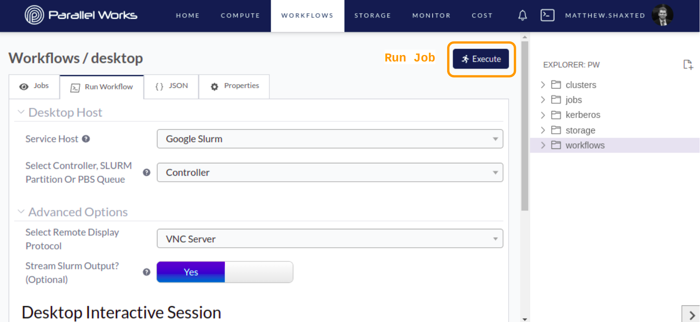
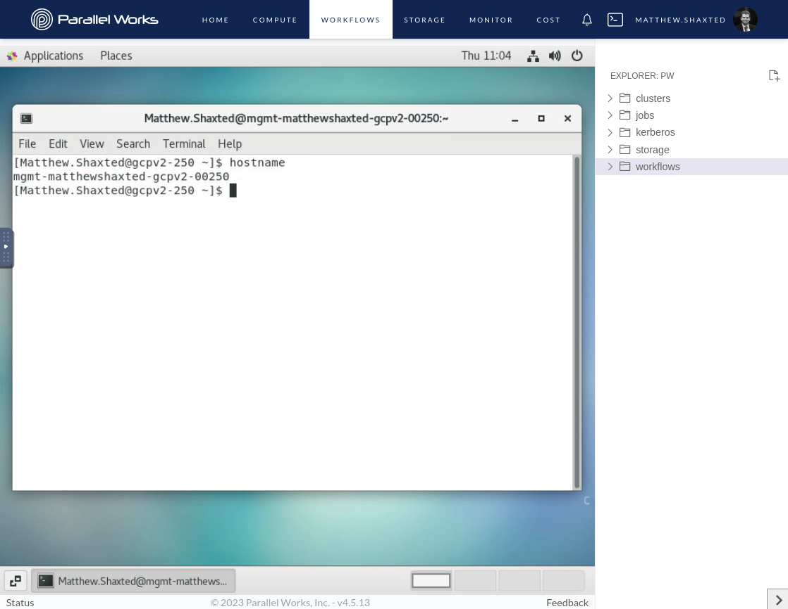

## Interactive Session
Interactive session workflows initiate a server, such as a remote desktop or Jupyter Notebook server, on your chosen resource and establish a connection through an SSH tunnel to link it to the Parallel Works platform.

You can launch interactive sessions on the controller or login node of a cluster, on a compute node of a SLURM partition or PBS queue, or in your user workspace (user container).

Here's how to use an interactive session job:

1. Choose the resource where you want to start the server.
2. Enter or review the input parameters in the provided form. You can find detailed descriptions of each parameter by hovering over the question mark icon.
3. Click the "execute" button to launch the job.
4. Access the server by clicking the "eye" icon in the workflow monitor. Note that the connection is established only after the server is running. This might take some time if the job is in a queue, if compute nodes are starting, or if the job is installing required software. For more information on the job's status, check the logs.
5. When you're done, click the red "no" symbol to cancel or stop the job.

